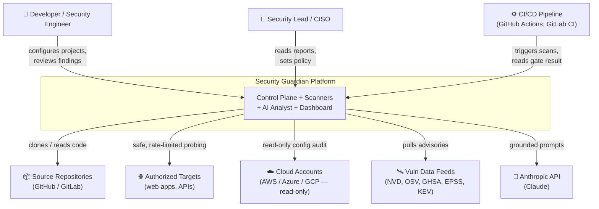
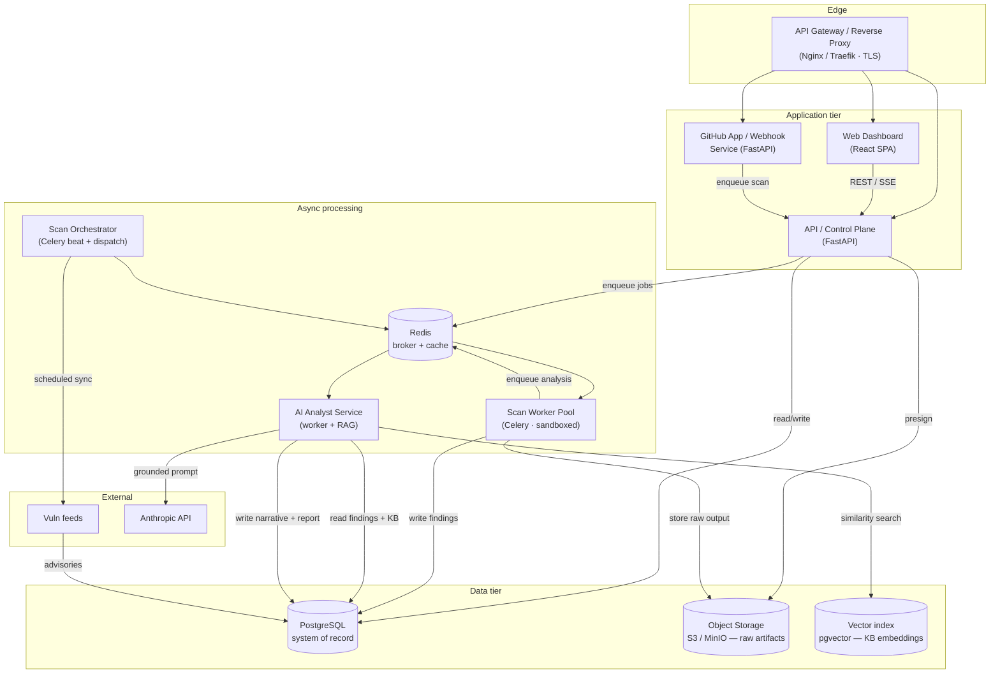
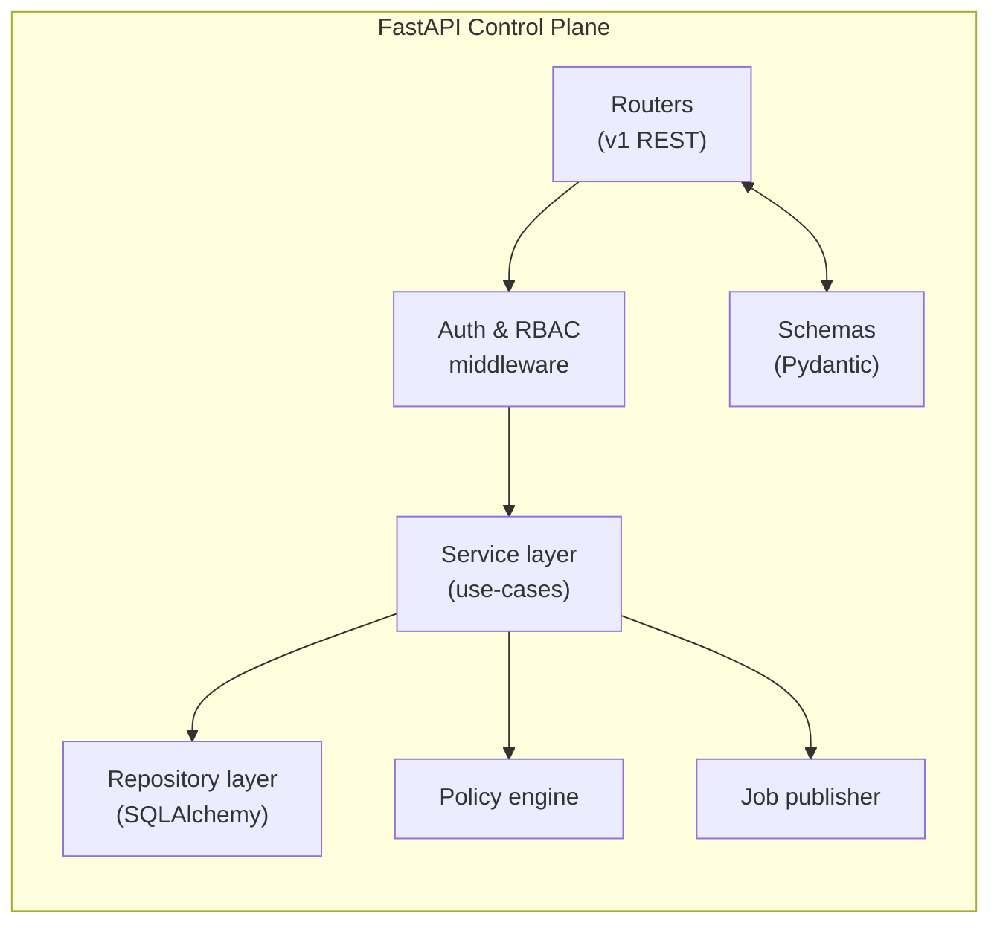
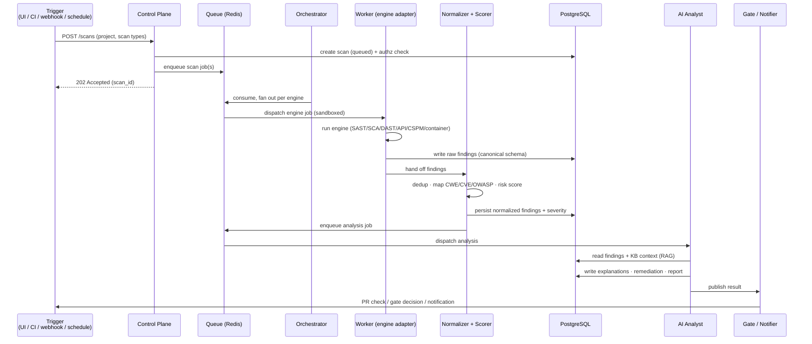
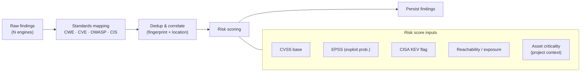
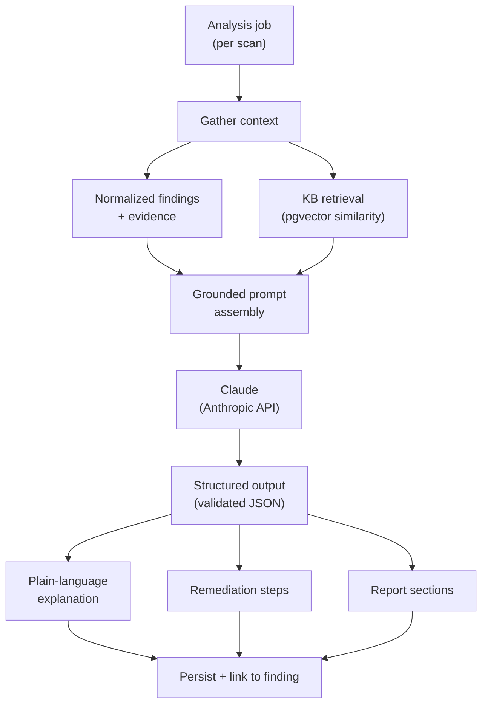
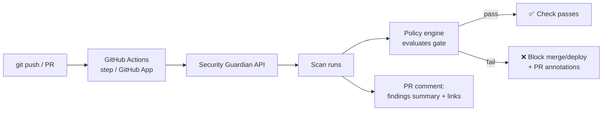
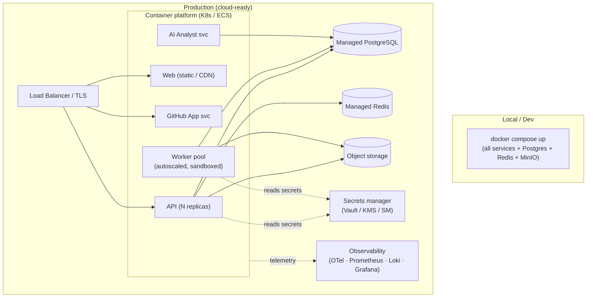

# 01 — System Architecture

> The complete architecture for the Security Guardian Platform: context, containers, components,
> data flows, the six scanner engines, the AI analyst pipeline, and deployment topology.

---

## 1. Context (C4 Level 1)

Who and what the platform interacts with.



**Trust posture:** the platform holds read-only or scoped credentials for the assets it audits.
It never receives write/deploy permissions on target systems. All target interaction is
non-destructive. See [06 — Security Model](06-security-model.md).

---

## 2. Container view (C4 Level 2)

The deployable pieces and how they talk.



### Container responsibilities

| Container | Responsibility |
|---|---|
| **API / Control Plane** (FastAPI) | AuthN/Z, projects, scan lifecycle, findings API, policy, reports, SSE progress. The only writer of business rules. |
| **Web Dashboard** (React) | Project management, scan history, finding triage, report viewing, policy config. |
| **GitHub App / Webhook Service** | Receives push/PR events, verifies signatures, enqueues scans, writes PR checks & comments. |
| **Scan Orchestrator** (Celery beat) | Scheduled scans, feed syncs, retries, fan-out of multi-engine scans, timeout enforcement. |
| **Scan Worker Pool** (Celery) | Runs pluggable engine adapters inside sandboxes; emits canonical findings. Horizontally scalable. |
| **AI Analyst Service** | RAG over the knowledge base + findings; explanation, scoring assist, remediation, report drafting. |
| **PostgreSQL** | System of record: tenants, projects, scans, findings, KB, reports, audit. |
| **Redis** | Celery broker + result backend + cache + rate-limit counters. |
| **Object Storage** | Raw scanner output, SBOMs, generated report PDFs — large blobs kept out of the DB. |
| **Vector index** (pgvector) | Embeddings of KB entries and finding descriptions for retrieval-grounded AI. |

> **Queue note:** Redis + Celery is the Phase-1 default for velocity. The queue is abstracted behind
> a `JobQueue` interface so a swap to RabbitMQ or SQS (for stronger delivery guarantees at scale) is
> a config change, not a rewrite. See [04 — Technology Decisions](04-technology-decisions.md).

---

## 3. Component view — Control Plane



Clean layering: **routers** (transport) → **services** (use-cases, transactions) →
**repositories** (persistence). Pydantic schemas guard the edges; SQLAlchemy models never leak past
the repository layer. The **policy engine** evaluates gate rules; the **job publisher** is the only
component that enqueues work.

---

## 4. The scanning pipeline

The canonical lifecycle of a scan, from trigger to report.



**Idempotency & resumability:** each engine job is idempotent on `(scan_id, engine, target_hash)`.
Partial failures degrade gracefully — one failed engine does not fail the whole scan; the scan
record aggregates per-engine status.

---

## 5. Scanner engines

All engines implement one interface and emit the **canonical finding schema** (see
[03 — Database Schema §Findings](03-database-schema.md)). The core never knows engine internals.

```python
# Conceptual adapter contract (illustrative, not final code)
class ScanEngine(Protocol):
    key: str  # "sast", "sca", "dast", "api", "cspm", "container"

    def supports(self, target: Target) -> bool: ...
    def run(self, ctx: ScanContext) -> Iterable[RawFinding]: ...
    def health(self) -> EngineHealth: ...
```

| Engine | Class | Primary tools (wrapped) | Emits |
|---|---|---|---|
| **SAST** | Source code | Semgrep (rulesets), Bandit (Py), ESLint-security, plus custom rules | Insecure patterns, authN/Z flaws, injection, insecure config |
| **Secrets** | Source code | Gitleaks / TruffleHog + entropy heuristics | Hardcoded secrets, exposed API keys, tokens in history |
| **SCA** | Dependencies | OSV-Scanner, Trivy (fs), Syft (SBOM) | Vulnerable/outdated deps, supply-chain & license risk |
| **DAST-lite** | Web apps | Header/TLS analyzer, testssl-style checks, auth/session probes | Missing headers, weak TLS, cookie/session issues, common OWASP web risks |
| **API** | APIs | OpenAPI/Swagger analyzer + active safe probes | Missing authN, weak input validation, no rate limiting, verbose errors, misconfig |
| **CSPM** | Cloud | Prowler / ScoutSuite-style read-only checks (AWS/Azure/GCP) | IAM over-permission, public storage, open security groups, unencrypted resources |
| **Container** | Containers/K8s | Trivy (image), Hadolint (Dockerfile), kube-linter/Checkov (manifests) | Image CVEs, Dockerfile smells, risky K8s config |

**Engine principles**

- **Wrap, don't reinvent.** Each engine shells out to a hardened, pinned, well-tested OSS scanner in
  a sandbox, then maps output to the canonical schema. Proprietary value is in normalization,
  correlation, scoring, AI analysis, and workflow — not re-implementing scanners.
- **Safe & authorized.** Active engines (DAST, API) require a per-target authorization record and run
  read-only, rate-limited, non-destructive checks only. No exploitation, no fuzzing-to-crash, no DoS.
- **Sandboxed.** Every run is network-egress-restricted (target allowlist only), CPU/mem/time-bounded,
  and filesystem-isolated. Cloud audits use read-only, least-privilege roles.

### Normalization, dedup & risk scoring



Final **severity (Critical/High/Medium/Low)** is a deterministic function of CVSS + EPSS + KEV +
exposure + asset criticality. The score is transparent and reproducible; the AI **explains** it but
does not silently override it (any AI-suggested adjustment is recorded as a separate, auditable
signal).

---

## 6. AI Security Analyst

A **retrieval-grounded** layer that turns normalized findings into human-grade output. It augments
deterministic results; it never invents severities or fabricates evidence.



**Grounding & guardrails**

- Every AI claim is tied to a specific finding ID and KB reference — no free-floating assertions.
- Output is **structured** (validated against a schema) so it slots cleanly into reports and the UI.
- Severity and CVSS come from the deterministic scorer; the AI provides *narrative, context,
  prioritization rationale, and fixes*, and flags uncertainty explicitly.
- Prompt-injection defense: repo/scan content is treated as untrusted data, never as instructions
  (delimited, role-separated). See [06 — Security Model](06-security-model.md).
- The model is configurable and the platform stays LLM-agnostic behind an `LLMProvider` interface;
  the default is Claude via the Anthropic API.

### Report structure (generated per scan)

1. **Executive summary** — posture, top risks, trend vs. previous scan (business language).
2. **Vulnerability list** — each with **Severity**, **Evidence**, **Impact**, **Recommended fix**,
   **References** (CWE/CVE/OWASP/CIS/ASVS).
3. **Standards mapping appendix** — OWASP Top 10 / ASVS / CIS coverage.
4. **Remediation plan** — prioritized, effort-tagged.

Reports render as HTML in-app and export to **PDF** (stored in object storage).

---

## 7. DevSecOps integration



- **GitHub App** posts a **Check Run** and inline PR annotations; policy decides pass/fail.
- **Reusable GitHub Action** + **CLI** (`guardian scan`) for any CI/CD system; exit code drives gates.
- **Policy engine** is declarative (e.g. *"fail on any Critical, or High with EPSS > 0.5, or a KEV
  match"*), versioned per project, with documented break-glass overrides recorded in the audit log.

---

## 8. Deployment topology



- **Single command for dev:** `docker compose up` brings up the whole stack.
- **Cloud-ready:** stateless services scale horizontally; state lives in managed Postgres/Redis/object
  storage; secrets in a dedicated manager; full observability (traces, metrics, structured logs).
- **12-factor config** via environment; no secrets in images or repos.

---

## 9. Cross-cutting concerns

| Concern | Approach |
|---|---|
| **AuthN** | OAuth2 / OIDC + JWT sessions; GitHub OAuth for repo access; API keys for CI. |
| **AuthZ** | RBAC scoped to organization → project; every query is tenant-filtered. |
| **Observability** | OpenTelemetry traces end-to-end; Prometheus metrics; structured JSON logs; scan-level audit trail. |
| **Reliability** | Idempotent jobs, retries with backoff, per-engine timeouts, graceful partial-failure. |
| **Data lifecycle** | Configurable retention for raw artifacts; findings and reports kept per policy; PII-minimizing. |
| **Extensibility** | New engine = new adapter implementing `ScanEngine`; new LLM = new `LLMProvider`; new feed = new sync job. |
| **Configuration** | Central typed settings (Pydantic Settings); environment-driven; validated at startup. |

See the remaining docs for the physical layout ([02](02-folder-structure.md)), data model
([03](03-database-schema.md)), stack rationale ([04](04-technology-decisions.md)), delivery plan
([05](05-development-roadmap.md)), and self-security ([06](06-security-model.md)).
