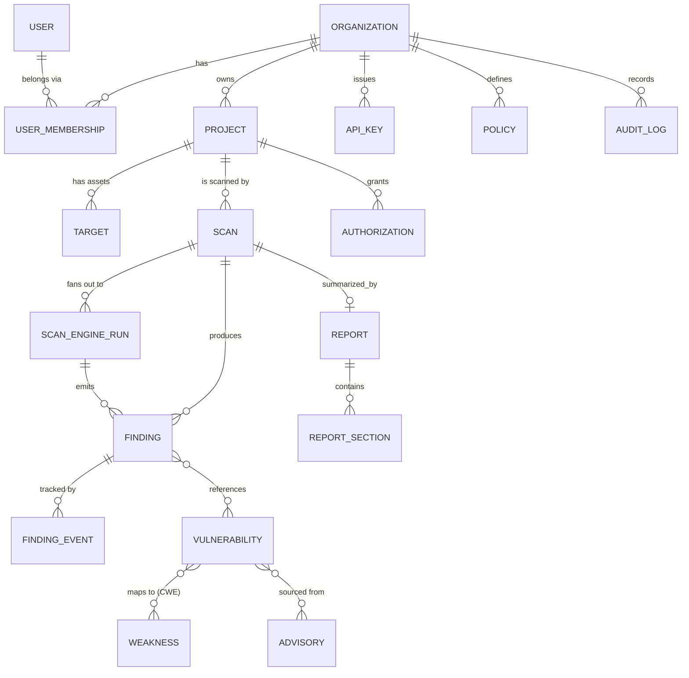

# 03 — Database Schema

PostgreSQL is the system of record. This document defines the relational model, the canonical
finding schema, the vulnerability knowledge base, indexing/retention, and the migration strategy.

## Design rules

- **UUID v7 primary keys** (time-sortable) on every table.
- **Multi-tenant by construction:** every business row carries `organization_id`; all queries are
  tenant-filtered (Row-Level Security enforced at the DB as defense-in-depth).
- **Soft context, hard audit:** status transitions and sensitive actions are recorded in
  `audit_log`. No silent mutation of security data.
- **JSONB for engine-shaped detail**, typed columns for everything queried/filtered/scored.
- **`created_at` / `updated_at`** (UTC, `timestamptz`) on every table; triggers maintain `updated_at`.
- **Extensions:** `pgcrypto` (UUIDs/hashing), `pgvector` (KB embeddings).

## Entity-relationship overview



## Tables

### Identity & tenancy

**`organizations`** — top tenant boundary.
| column | type | notes |
|---|---|---|
| id | uuid PK | |
| name | text | |
| slug | citext UNIQUE | |
| plan | text | free/pro/enterprise |
| settings | jsonb | |
| created_at, updated_at | timestamptz | |

**`users`**
| column | type | notes |
|---|---|---|
| id | uuid PK | |
| email | citext UNIQUE | |
| name | text | |
| password_hash | text NULL | null when SSO-only (Argon2id) |
| mfa_enabled | boolean | |
| status | text | active/invited/disabled |

**`user_memberships`** — user ↔ org with role (RBAC).
| column | type | notes |
|---|---|---|
| id | uuid PK | |
| user_id | uuid FK → users | |
| organization_id | uuid FK → organizations | |
| role | text | `owner` \| `admin` \| `analyst` \| `developer` \| `viewer` |
| UNIQUE(user_id, organization_id) | | |

**`api_keys`** — CI/CD & programmatic access.
| column | type | notes |
|---|---|---|
| id | uuid PK | |
| organization_id | uuid FK | |
| name | text | |
| key_hash | text | store hash only (never the token) |
| scopes | text[] | |
| last_used_at | timestamptz NULL | |
| expires_at | timestamptz NULL | |
| revoked_at | timestamptz NULL | |

### Projects, targets & authorization

**`projects`** — a system under assessment.
| column | type | notes |
|---|---|---|
| id | uuid PK | |
| organization_id | uuid FK | |
| name | text | |
| repo_url | text NULL | |
| default_branch | text | |
| criticality | text | `low`\|`medium`\|`high`\|`critical` (feeds risk scoring) |
| settings | jsonb | enabled engines, schedules |

**`targets`** — concrete assets belonging to a project.
| column | type | notes |
|---|---|---|
| id | uuid PK | |
| project_id | uuid FK | |
| kind | text | `repo`\|`web`\|`api`\|`cloud_account`\|`container_image`\|`k8s_manifest` |
| identifier | text | URL / ARN / image ref / path |
| config | jsonb | scoped, encrypted credential *references* (never raw secrets) |

**`authorizations`** — **the safe-scanning gate.** Active probing (DAST/API/cloud) is blocked
without a current record here.
| column | type | notes |
|---|---|---|
| id | uuid PK | |
| project_id | uuid FK | |
| target_id | uuid FK NULL | |
| scope | text | what is authorized |
| authorized_by | uuid FK → users | |
| method | text | ownership-verified / written-consent |
| valid_from, valid_until | timestamptz | |
| revoked_at | timestamptz NULL | |

### Scans

**`scans`**
| column | type | notes |
|---|---|---|
| id | uuid PK | |
| organization_id | uuid FK | |
| project_id | uuid FK | |
| trigger | text | `manual`\|`schedule`\|`webhook`\|`ci` |
| ref | text NULL | git sha / branch / PR number |
| status | text | `queued`\|`running`\|`completed`\|`failed`\|`partial`\|`canceled` |
| requested_engines | text[] | |
| stats | jsonb | counts by severity (denormalized for fast lists) |
| started_at, finished_at | timestamptz NULL | |

**`scan_engine_runs`** — one row per engine within a scan (per-engine status/timing).
| column | type | notes |
|---|---|---|
| id | uuid PK | |
| scan_id | uuid FK | |
| engine | text | `sast`\|`secrets`\|`sca`\|`dast`\|`api`\|`cspm`\|`container` |
| status | text | queued/running/completed/failed/skipped |
| tool_versions | jsonb | reproducibility |
| raw_artifact_uri | text NULL | pointer into object storage |
| error | text NULL | |
| UNIQUE(scan_id, engine) | | idempotency |

### Findings — the canonical schema

**`findings`** — engine-agnostic, standards-mapped. This is the schema every engine normalizes into.
| column | type | notes |
|---|---|---|
| id | uuid PK | |
| organization_id | uuid FK | tenant scope |
| scan_id | uuid FK | |
| engine_run_id | uuid FK | |
| project_id | uuid FK | denormalized for querying |
| fingerprint | text | stable hash of (rule, location, target) → dedup across scans |
| title | text | |
| description | text | |
| category | text | e.g. injection, secret, misconfig, vuln-dep, weak-tls |
| cwe_id | text NULL | e.g. CWE-89 |
| owasp_ref | text NULL | e.g. A03:2021 |
| cve_ids | text[] | linked CVEs |
| cvss_base | numeric(3,1) NULL | |
| epss_score | numeric NULL | exploit probability |
| kev | boolean | CISA Known-Exploited flag |
| severity | text | **`critical`\|`high`\|`medium`\|`low`\|`info`** (deterministic scorer output) |
| confidence | text | high/medium/low |
| status | text | `open`\|`triaged`\|`confirmed`\|`false_positive`\|`accepted_risk`\|`resolved` |
| location | jsonb | file+line / endpoint / resource ARN / image layer |
| evidence | jsonb | snippet / request-response / config excerpt (sanitized) |
| remediation | jsonb NULL | AI-drafted fix (steps, code, references) |
| ai_explanation | text NULL | plain-language narrative |
| first_seen_scan_id | uuid NULL | trend tracking |
| references | jsonb | CWE/CVE/OWASP/CIS/ASVS links |

> Dedup: a finding's `fingerprint` lets the platform track the *same* issue across scans (first-seen,
> still-open, regressed, resolved) rather than re-counting it each run.

**`finding_events`** — immutable status/triage history per finding.
| column | type | notes |
|---|---|---|
| id | uuid PK · finding_id FK · actor_id FK NULL · from_status · to_status · note · created_at | audit of triage |

### Vulnerability knowledge base

**`vulnerabilities`** — normalized CVE/GHSA/OSV records.
| column | type | notes |
|---|---|---|
| id | uuid PK | |
| external_id | text UNIQUE | e.g. CVE-2024-1234 / GHSA-xxxx |
| source | text | nvd/osv/ghsa |
| summary | text | |
| cvss_vector | text NULL | |
| cvss_base | numeric(3,1) NULL | |
| epss_score | numeric NULL | |
| kev | boolean | |
| affected | jsonb | package/ecosystem/version ranges |
| published_at, modified_at | timestamptz | |

**`weaknesses`** — CWE catalog.
| id | external_id (CWE-###) | name | description | relationships jsonb |

**`advisories`** — raw source advisories (provenance for `vulnerabilities`).
| id | source | url | payload jsonb | fetched_at |

**`kb_entries`** — curated best-practices, OWASP/CIS/ASVS guidance, remediation templates.
| id | kind | title | body | standards jsonb | embedding `vector(1536)` |

`kb_entries.embedding` (pgvector) powers RAG retrieval for the AI analyst.

**`feed_syncs`** — bookkeeping for scheduled feed updates (NVD, OSV, GHSA, EPSS, KEV).
| id | source | status | items_ingested | started_at | finished_at | cursor |

### Reports

**`reports`**
| id | organization_id FK | scan_id FK | format (html/pdf) | status | summary jsonb | artifact_uri NULL | generated_at |

**`report_sections`**
| id | report_id FK | kind (`executive`\|`findings`\|`standards`\|`remediation`) | title | body | ordering |

### Policy & audit

**`policies`** — declarative gate rules per project/org.
| id | organization_id FK | project_id FK NULL | name | rules jsonb | enabled | version |

Example `rules`: `{ "fail_on": [{"severity":"critical"}, {"severity":"high","epss_gt":0.5}, {"kev":true}] }`

**`audit_log`** — tamper-evident record of security-relevant actions.
| id | organization_id FK | actor_id FK NULL | action | entity_type | entity_id | metadata jsonb | ip | created_at |

## Illustrative DDL (excerpt)

```sql
CREATE EXTENSION IF NOT EXISTS pgcrypto;
CREATE EXTENSION IF NOT EXISTS vector;

CREATE TYPE severity AS ENUM ('critical','high','medium','low','info');
CREATE TYPE finding_status AS ENUM
  ('open','triaged','confirmed','false_positive','accepted_risk','resolved');

CREATE TABLE findings (
  id                 uuid PRIMARY KEY DEFAULT gen_random_uuid(),
  organization_id    uuid NOT NULL REFERENCES organizations(id),
  scan_id            uuid NOT NULL REFERENCES scans(id) ON DELETE CASCADE,
  engine_run_id      uuid NOT NULL REFERENCES scan_engine_runs(id),
  project_id         uuid NOT NULL REFERENCES projects(id),
  fingerprint        text NOT NULL,
  title              text NOT NULL,
  category           text NOT NULL,
  cwe_id             text,
  owasp_ref          text,
  cve_ids            text[] NOT NULL DEFAULT '{}',
  cvss_base          numeric(3,1),
  epss_score         numeric,
  kev                boolean NOT NULL DEFAULT false,
  severity           severity NOT NULL,
  confidence         text NOT NULL DEFAULT 'medium',
  status             finding_status NOT NULL DEFAULT 'open',
  location           jsonb NOT NULL DEFAULT '{}',
  evidence           jsonb NOT NULL DEFAULT '{}',
  remediation        jsonb,
  ai_explanation     text,
  references         jsonb NOT NULL DEFAULT '{}',
  created_at         timestamptz NOT NULL DEFAULT now(),
  updated_at         timestamptz NOT NULL DEFAULT now()
);

-- Fast tenant-scoped listing & triage
CREATE INDEX idx_findings_org_project_status ON findings (organization_id, project_id, status);
CREATE INDEX idx_findings_scan_severity      ON findings (scan_id, severity);
CREATE INDEX idx_findings_fingerprint        ON findings (project_id, fingerprint);
CREATE INDEX idx_findings_cve                ON findings USING gin (cve_ids);

-- Defense-in-depth tenant isolation
ALTER TABLE findings ENABLE ROW LEVEL SECURITY;
CREATE POLICY tenant_isolation ON findings
  USING (organization_id = current_setting('app.current_org')::uuid);
```

## Indexing strategy (summary)

| Access pattern | Index |
|---|---|
| List findings for a project by status | `(organization_id, project_id, status)` |
| Scan detail severity rollup | `(scan_id, severity)` |
| Dedup / trend by fingerprint | `(project_id, fingerprint)` |
| CVE lookups | GIN on `cve_ids` |
| KB semantic search | `ivfflat` / `hnsw` on `kb_entries.embedding` |
| Vuln lookup during SCA | UNIQUE on `vulnerabilities.external_id` + GIN on `affected` |

## Retention & lifecycle

- **Raw engine artifacts** (object storage): default 30/90-day TTL, configurable per org.
- **Findings & reports:** retained per plan/policy; findings never hard-deleted while a scan exists —
  status changes are tracked, not overwritten.
- **`audit_log`:** append-only, long retention; considered compliance data.
- **KB & vulnerabilities:** continuously refreshed by `feed_syncs`; historical versions preserved via
  `modified_at`.

## Migrations

- **Alembic**, autogenerate reviewed by hand; every migration reversible.
- Migrations run as a gated CI/CD step; **expand → migrate → contract** for zero-downtime schema
  change. Enum additions are additive; column drops happen only after code no longer references them.
- Seed data (CWE catalog, OWASP/CIS/ASVS mappings, KB starter set) is loaded via versioned seed
  scripts in `scripts/` and `knowledge_base/seeds/`.
