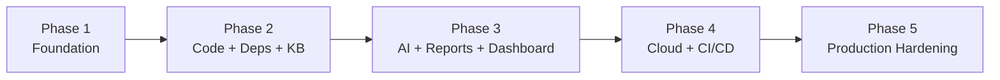

# 05 — Development Roadmap

Five phases, each shippable and independently valuable. Every phase lists **scope**, **exit
criteria**, and **dependencies**. Nothing here is built until this architecture package is approved.

---

## Phase 1 — Foundation

**Goal:** a running skeleton that can authenticate a user, register a project, and execute a trivial
scan end-to-end through the real pipeline.

**Scope**
- Monorepo scaffolding, tooling (ruff/mypy/pytest, pre-commit), `docker-compose` full-stack up.
- Database: core tables (orgs, users, memberships, projects, targets, scans, scan_engine_runs,
  findings, audit_log) + Alembic + RLS + seed script.
- Control plane: FastAPI app factory, layered structure, OAuth2/OIDC + JWT auth, RBAC, API keys.
- Async backbone: Celery + Redis, `JobQueue` port, one **reference engine** (secrets scan) proving
  trigger → queue → worker → canonical finding → persist.
- Canonical finding schema + severity model in `packages/core`.
- CI: lint, type-check, test, build images.

**Exit criteria**
- `docker compose up` → create account → create project → run a secrets scan → see a normalized
  finding in the DB and via the API. Green CI. Auth + tenant isolation covered by tests.

**Dependencies:** none (bootstraps the repo).

---

## Phase 2 — Code Analysis, Dependencies & Vulnerability Database

**Goal:** real, valuable static findings and a live vulnerability knowledge base.

**Scope**
- **SAST engine**: Semgrep + Bandit + ESLint-security adapters → canonical findings, CWE/OWASP mapping.
- **SCA engine**: OSV-Scanner + Trivy + Syft (SBOM) → vulnerable/outdated deps, supply-chain/license.
- **Secrets engine** hardened (history scanning, entropy tuning, allowlist/false-positive handling).
- **Vulnerability KB**: `vulnerabilities`, `weaknesses`, `advisories`, `kb_entries`, `feed_syncs`;
  scheduled sync jobs for NVD, OSV, GHSA, EPSS, KEV; CWE catalog + OWASP/CIS/ASVS seed mappings.
- **Normalization + dedup + risk scoring** pipeline (CVSS + EPSS + KEV + exposure + asset criticality).
- Sandbox hardening for workers (egress allowlist, resource/time limits, isolation).

**Exit criteria**
- Scanning a real repo yields deduplicated, standards-mapped, severity-scored findings for code +
  dependencies. Feed syncs run on schedule and enrich findings with CVSS/EPSS/KEV. Trend tracking
  (first-seen / still-open) works across repeat scans.

**Dependencies:** Phase 1 (schema, queue, engine interface, scoring contracts).

---

## Phase 3 — AI Security Analyst, Reporting & Dashboard

**Goal:** turn findings into human-grade, prioritized reports and give users a UI to work them.

**Scope**
- **AI analyst service**: `LLMProvider` (Claude) + RAG over `kb_entries` (pgvector); explanation,
  remediation drafting, prioritization; **schema-validated** structured output; injection-hardened,
  versioned prompts; guardrail + golden-output tests.
- **Reporting**: executive summary + vulnerability list (severity, evidence, impact, fix, references)
  + standards appendix + remediation plan; HTML render + PDF export to object storage.
- **Dashboard (React)**: auth, project management, scan history, live scan progress (SSE), finding
  triage (status workflow), report viewer, severity/trend visualizations.

**Exit criteria**
- A completed scan produces a full report with AI explanations grounded in real findings + KB
  references, viewable and exportable in the dashboard; users can triage findings and see trends.
  AI never emits a severity or CVE not backed by a finding (verified by guardrail tests).

**Dependencies:** Phase 2 (findings, KB, scoring).

---

## Phase 4 — Cloud Security & CI/CD Integration

**Goal:** extend coverage to cloud + containers and embed the platform in the developer workflow.

**Scope**
- **CSPM engine**: AWS/Azure/GCP read-only, least-privilege config audits (IAM risk, public storage,
  open networking, unencrypted resources); mapped to CIS Benchmarks.
- **Container engine**: Trivy image scan, Hadolint Dockerfile, kube-linter/Checkov manifests.
- **DAST-lite + API engines**: header/TLS/session probes and OpenAPI-driven safe API checks — all
  gated by the `authorizations` table (no active probing without a valid authorization record).
- **DevSecOps**: GitHub App (Check Runs, inline PR annotations, comments), reusable GitHub Action,
  `guardian` CLI, and the **declarative policy engine** driving deployment gates.

**Exit criteria**
- A push/PR triggers a scan via the GitHub App; findings post to the PR; the policy engine passes or
  blocks the check per rules. Cloud and container targets produce CIS-mapped findings. Active web/API
  scans run only with authorization on record.

**Dependencies:** Phase 3 (reports/UI to surface results), Phase 2 (scoring/normalization).

---

## Phase 5 — Production Hardening

**Goal:** make it safe, reliable, and operable at scale — commercial-grade.

**Scope**
- Security: full threat-model closure, secrets manager integration, dependency + container signing,
  SBOM publishing, the platform **self-scanning** in CI, pen-test remediation, rate limiting & abuse
  controls, data retention/erasure workflows.
- Reliability: autoscaling worker pools, backpressure, DLQ handling, graceful degradation, DR/backup
  runbooks, load testing.
- Observability: complete OTel coverage, SLOs + alerting, audit dashboards.
- Compliance: OWASP ASVS L2 verification, NIST CSF mapping documented, evidence exports.
- Ops: Helm chart, Terraform modules, upgrade/migration runbooks, admin docs.

**Exit criteria**
- Documented SLOs met under load; ASVS L2 checklist satisfied; self-scan green; DR restore verified;
  one-command install for both dev (compose) and prod (Helm). Ready for real users on their own
  authorized assets.

**Dependencies:** all prior phases.

---

## Sequencing principles

- **Vertical slices first.** Phase 1 proves the *entire* pipeline with one trivial engine before
  breadth is added — architecture risk is retired early.
- **Schema before engines.** The canonical finding model and scoring contracts (Phase 1) are frozen
  early so every later engine conforms.
- **Safety gates precede active scanning.** The `authorizations` mechanism ships with/before the DAST,
  API, and cloud engines (Phase 4), never after.
- **Each phase is demoable and useful on its own** — no phase is purely internal plumbing.
