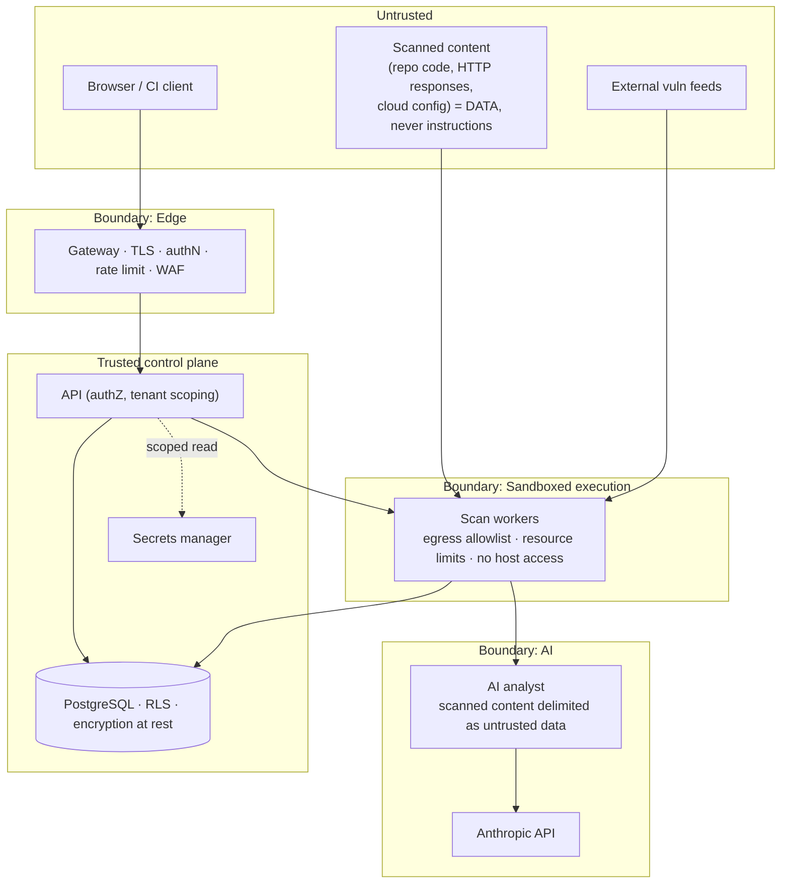
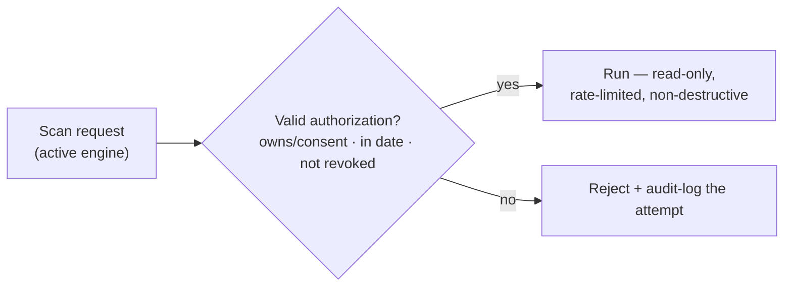

# 06 — Security Model

A security product must be exemplary about its own security. This document defines the threat model,
trust boundaries, tenant isolation, secrets handling, safe-scanning guarantees, and the standards the
platform is measured against. A tool that audits others must withstand the same scrutiny.

## 1. Security objectives

1. **Do no harm.** Scanning is non-destructive, rate-limited, and only ever runs against **authorized**
   assets. No exploitation, no DoS, no offensive automation — enforced in code, not just policy.
2. **Strict tenant isolation.** One organization can never read or influence another's data or scans.
3. **Least privilege everywhere.** Credentials for audited assets are read-only/scoped; workers run
   sandboxed with minimal rights.
4. **Confidentiality of findings.** Vulnerability data is sensitive; it is encrypted, access-controlled,
   and audited.
5. **Integrity & auditability.** Security-relevant actions are recorded in a tamper-evident audit log.

## 2. Trust boundaries

**Key boundaries**

- **Edge:** TLS termination, authentication, rate limiting, input validation, security headers, optional
  WAF. Nothing reaches the control plane unauthenticated.
- **Sandbox:** every scan runs isolated — restricted network egress (target allowlist only), CPU/mem/
  time limits, ephemeral filesystem, no access to platform secrets beyond the specific scoped
  credential for that target. A malicious repo or hostile HTTP response cannot pivot into the platform.
- **AI:** scanned content is always framed as **untrusted data**, never as instructions; prompts are
  role-separated and delimited to defeat prompt injection.

## 3. Threat model (STRIDE, abbreviated)

| Threat | Example | Mitigation |
|---|---|---|
| **Spoofing** | Forged CI request / stolen token | OAuth2/OIDC, signed GitHub webhooks, hashed API keys w/ scopes+expiry, MFA for humans |
| **Tampering** | Altering findings or gate results | RLS, service-layer authZ, immutable `finding_events` + `audit_log`, signed artifacts |
| **Repudiation** | "I didn't approve that override" | Append-only audit log with actor, IP, timestamp; break-glass overrides recorded |
| **Information disclosure** | Cross-tenant finding leak; secret in logs | Tenant scoping + RLS; encryption at rest/in transit; secret redaction in logs & evidence |
| **Denial of service** | Scan-bombing; runaway engine | Per-org rate limits & quotas; worker time/resource caps; queue backpressure & DLQ |
| **Elevation of privilege** | Worker escapes sandbox; role bypass | Sandboxed workers, least-privilege roles, RBAC checks in the service layer, deny-by-default |

### Product-specific top risks

- **Malicious scan target** (hostile repo/site trying to exploit the scanner) → sandbox isolation +
  pinned, hardened tools + egress allowlist.
- **Prompt injection via scanned content** (code/comments instructing the AI) → untrusted-data framing,
  structured/validated output, grounding, no tool-execution authority from AI text.
- **Credential theft** (audited-asset creds are high value) → secrets manager, scoped read-only roles,
  short-lived tokens, never stored in DB rows or images, encrypted at rest.
- **Unauthorized scanning** (platform abused to attack third parties) → `authorizations` gate below.

## 4. The authorization gate (safe scanning)

Active engines (**DAST**, **API**, **cloud**) **must not run** without a valid record in the
`authorizations` table proving the org owns or has written consent to test the target.

- Passive engines (SAST, secrets, SCA on code you provide) operate on artifacts the org supplies.
- Active checks are **read-only and non-destructive by design** — header/TLS inspection, auth-flow
  observation, config review. No fuzz-to-crash, no exploit payloads, no volumetric traffic.
- Cloud audits use customer-provided **read-only, least-privilege** roles; the platform never receives
  write/deploy permissions.

## 5. Identity, authentication & authorization

- **Humans:** OAuth2/OIDC (incl. GitHub) or password (**Argon2id**) + optional MFA; short-lived JWT
  sessions with refresh; secure, `HttpOnly`, `SameSite` cookies.
- **Machines:** API keys (hash-stored, scoped, expiring, revocable) for CI/CD; signed GitHub App
  webhooks.
- **RBAC:** roles `owner / admin / analyst / developer / viewer`, scoped **org → project**. Deny-by-
  default; authorization enforced in the **service layer** (not just routes) and backstopped by
  Postgres **RLS**. Every query is tenant-filtered.

## 6. Data protection

| Data | Protection |
|---|---|
| In transit | TLS 1.2+ everywhere (edge, internal service-to-service, DB) |
| At rest | Disk/DB encryption; object storage SSE; app-level encryption for stored credential references |
| Secrets | Dedicated manager (Vault / cloud KMS / SM); **never** in DB rows, images, or repos; injected via env at runtime |
| Findings/evidence | Sensitive class; access-controlled, tenant-scoped, redacted of embedded secrets before storage |
| Logs | Structured, secret-scrubbed; no tokens/PII; audit log separated from operational logs |
| PII | Minimized (email + name only for users); erasure workflow in Phase 5 |

## 7. Application-security controls

- **Input validation:** Pydantic schemas at every boundary; deny-by-default; strict types.
- **Injection defense:** parameterized queries via SQLAlchemy (no string SQL); output encoding in the UI.
- **AuthZ on every object:** no IDOR — every fetch re-checks tenant + role.
- **CSRF/CORS:** strict CORS allowlist; anti-CSRF for cookie-auth flows.
- **Security headers:** HSTS, CSP, `X-Content-Type-Options`, `Referrer-Policy`, frame-deny.
- **Rate limiting & quotas:** per-identity and per-org, incl. scan concurrency caps.
- **Dependency & supply-chain hygiene:** pinned deps, lockfiles, SBOM published, image signing, and the
  platform **self-scans** in CI (dogfooding) — a Security Guardian release that fails its own gate does
  not ship.

## 8. Standards alignment

| Framework | How it is applied |
|---|---|
| **OWASP ASVS** | Target **L2** verification for the platform itself (Phase 5); ASVS refs attached to findings |
| **OWASP Top 10** | Detection coverage across engines; every web/API finding carries an `A0x:2021` mapping |
| **CWE** | Every finding carries a `cwe_id`; KB seeded with the CWE catalog |
| **NIST CSF 2.0** | Platform ops mapped to Identify/Protect/Detect/Respond/Recover; documented in Phase 5 |
| **CIS Benchmarks** | Cloud/container/K8s checks mapped to CIS controls |
| **Secure SDLC** | Threat modeling, code review, SAST/SCA in CI, signed releases, disclosure policy (`SECURITY.md`) |

## 9. Secure SDLC for this project

- **Every PR:** lint, type-check, tests, **and the platform's own SAST/SCA/secrets scan** must pass.
- **Branch protection + CODEOWNERS** on security-sensitive paths (auth, sandbox, scoring, policy).
- **Coordinated disclosure** via `SECURITY.md`; a private advisory path for reporters.
- **Dependency review** on updates; signed, reproducible container builds; published SBOMs.
- **Least-privilege CI:** scoped tokens, no long-lived secrets in Actions, environment protection rules
  on deploys.

## 10. Assumptions & non-goals

- **Assumptions:** operators provide correctly-scoped read-only credentials; the deployment environment
  (K8s/cloud) is itself reasonably hardened; the secrets manager is trusted.
- **Non-goals:** the platform is **not** an offensive/exploitation toolkit, a DoS/stress tool, or an
  autonomous attacker. It detects, explains, and reports — it does not attack. These non-goals are
  design constraints, enforced by the authorization gate, the sandbox, and the safe-by-construction
  active engines.
