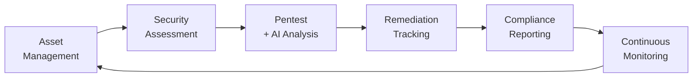
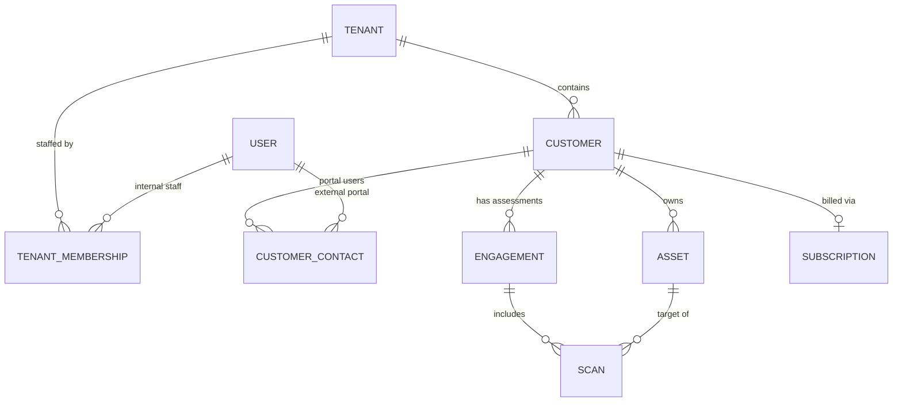
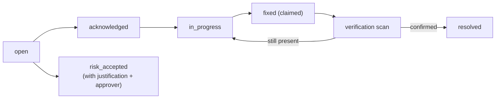
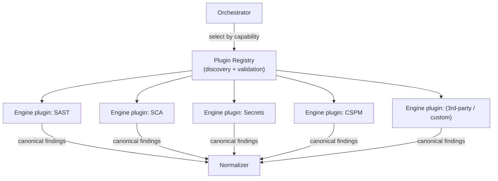
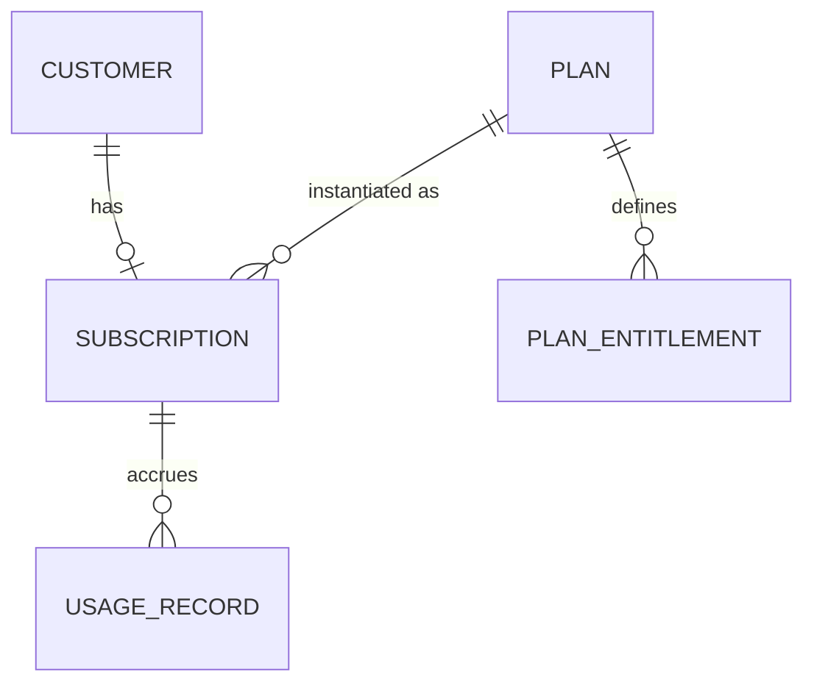
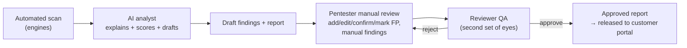

# 07 — Commercial Platform Design

This document extends the base architecture with the **strategic, commercial** requirements: the
platform is an **AI Security Operations Platform**, not just a scanner. It covers the hybrid tenancy
model, the customer portal domain, the plugin architecture, the billing/subscription layer (schema
only), the human-pentester workflow, and platform-wide audit and scope control.

## 1. Product framing — from scanner to Security Operations Platform

The recurring-revenue loop is the point: a customer onboards **assets**, we run **assessments**, an
**AI + human pentest** produces approved **reports**, findings become **tracked remediation**, results
roll up into **compliance** posture, and **continuous monitoring** re-triggers the loop. Each stage is
a reason to keep a subscription active.

## 2. Hybrid tenancy model

Two go-to-market motions are supported from day one on **one** data model:

| Motion | Who operates it | Access |
|---|---|---|
| **Self-service SaaS** | The customer's own team | Full portal; runs their own scans within plan limits |
| **Managed service** | Our security firm's pentesters/analysts | Staff operate on behalf of the customer; customer gets read/approval portal access |

### Core tenancy entities

- **`tenant`** — the top boundary. In pure SaaS, one tenant ≈ one customer company. In managed mode,
  our security firm is a tenant that owns **many** `customer` records.
- **`customer`** — a company being secured. Holds assets, engagements, subscription, contacts.
- **Two membership paths:**
  - **`tenant_membership`** — internal **staff** (owner/admin/pentester/analyst/reviewer) who can
    operate across the tenant's customers per role + assignment.
  - **`customer_contact`** — external **portal users** belonging to one customer, with portal-only
    roles (customer_admin / customer_viewer). They see *their* company's data only.

Every business row carries `tenant_id` **and** (where applicable) `customer_id`. RLS enforces
`tenant_id` isolation; the service layer additionally enforces `customer_id` scoping and staff
assignment. This single model serves both motions — SaaS is just the degenerate case of one customer
per tenant with self-service contacts.

## 3. Customer portal domain

The portal is the customer-facing surface of the operations loop.

| Concept | Table(s) | Purpose |
|---|---|---|
| **Companies** | `customer` | The client organization |
| **Assets** | `asset` | Repos, web apps, APIs, cloud accounts, images, K8s — inventory under management |
| **Engagements** | `engagement` | A scoped assessment/pentest effort (one-off or recurring) grouping scans |
| **Scans** | `scan` | Individual automated runs (from doc 03) |
| **Findings** | `finding` | Normalized results (from doc 03) |
| **Reports** | `report` | Approved deliverables (from doc 03) |
| **Remediation** | `remediation_item` | Tracked fix lifecycle per finding (owner, due date, status, verification) |

### Remediation tracking

A `remediation_item` links to a `finding`, carries an assignee, due date, SLA, and status, and closes
only after a **verification scan** confirms the fix (or an authorized approver formally accepts the
risk). This is what turns a report into an ongoing, monetizable service.

## 4. Plugin architecture (scanner extensibility)

Scanners are **plugins**, discovered at runtime — new engines are added without touching the core.

**Mechanism**
- Each plugin ships a **manifest** (`key`, `version`, `capabilities`, `target_kinds`, `is_active`,
  `requires_authorization`, resource profile) registered in a `scanner_plugin` table.
- Plugins implement the stable `ScanEngine` interface (doc 01 §5) and are loaded via Python **entry
  points** — first-party engines and third-party packages register the same way.
- The orchestrator selects plugins by **capability + target kind**, honoring `is_active` and per-tenant
  enablement. A registry row means an engine can be enabled/disabled/pinned per tenant **without a code
  deploy**.
- **Safety:** `requires_authorization=true` plugins (active DAST/API/cloud) are blocked by the
  authorization gate; every plugin runs in the standard sandbox.

`scanner_plugin` (registry table): `id · key · name · version · capabilities jsonb · target_kinds text[]
· requires_authorization bool · is_active bool · resource_profile jsonb · created_at`.
Per-tenant enablement: `tenant_scanner_config(tenant_id, plugin_id, enabled, settings jsonb)`.

## 5. Billing & subscription layer (schema-ready, no payments yet)

The data model is billing-ready so monetization is a later *feature*, not a *migration*. **No payment
processing is implemented in Phase 1** — these tables and the usage meter exist and are wired for read,
but no charge is ever made.

| Table | Purpose |
|---|---|
| `plan` | Named tiers (free/pro/enterprise): price ref, limits, features |
| `plan_entitlement` | Quotas/features per plan (max assets, scans/month, engines, seats, retention) |
| `subscription` | A customer's active plan: status, period, trial, cancel-at |
| `usage_record` | Metered events (scans run, assets monitored) for future billing & limit enforcement |

Phase 1 uses `plan_entitlement` to **enforce limits** (e.g. max assets, scan concurrency) — the
enforcement hook exists even though invoicing does not. A payment provider (Stripe, etc.) plugs into
`subscription`/`usage_record` later behind a `BillingProvider` port.

## 6. Human-pentester workflow (AI + automation + manual review + approval)

Automated findings and AI analysis are **inputs** to a human-governed deliverable. A report is not
customer-visible until a qualified reviewer approves it.

**Roles & states**
- **pentester** — reviews AI/automated output, adds manual findings, edits severity/evidence with
  justification, marks false positives.
- **reviewer** — independent QA; approves or returns the report. Approval is required to publish.
- **Report lifecycle:** `draft → in_review → approved → published` (with `rejected`/`revoked`),
  recorded on the `report` row plus a `report_approval` trail (actor, decision, notes, timestamp).
- **Finding provenance:** each finding records `source = automated | ai_assisted | manual` and a
  `reviewed_by` reference, so the deliverable is defensible and auditable.

This makes the platform sell a *service* (expert-reviewed pentest reports), not just raw tool output.

## 7. Platform-wide audit & scope control

- **Audit everything that matters:** every scan trigger, finding status change, report
  approval/publish, authorization grant/revoke, permission change, billing/plan change, and login is
  written to the append-only `audit_log` (actor, tenant, customer, action, entity, metadata, IP, time).
  Security decisions (risk-accept, gate override, manual severity change) are first-class audit events.
- **Permission-based, scope-controlled scanning:** no scan runs outside an explicit **scope**. Active
  engines require an `authorization` record (doc 06 §4); every engine run validates that its target is
  in the engagement's authorized scope. Staff access is further gated by **assignment** to the customer/
  engagement, not just role.

## 8. Schema additions (summary)

New/extended tables layered on top of doc 03 (all `tenant_id`-scoped, RLS-enforced):

| Table | Notes |
|---|---|
| `tenant` | top boundary (replaces bare `organization` as the isolation root) |
| `customer` | client company (managed or self-service) |
| `tenant_membership` | internal staff ↔ tenant, staff roles |
| `customer_contact` | external portal users ↔ customer |
| `asset` | inventory (supersedes/extends `target`) with kind + scope metadata |
| `engagement` | scoped assessment grouping scans, with authorized scope |
| `remediation_item` | fix lifecycle per finding |
| `scanner_plugin` + `tenant_scanner_config` | plugin registry + per-tenant enablement |
| `plan` · `plan_entitlement` · `subscription` · `usage_record` | billing-ready layer (no payments) |
| `report_approval` | pentester/reviewer approval trail |
| `audit_log` (extended) | now spans security + billing + workflow decisions |

Roles across both motions: **staff** `owner · admin · pentester · analyst · reviewer`; **portal**
`customer_admin · customer_viewer`.

> These additions are reflected in the Phase 1 implementation (SQLAlchemy models + initial Alembic
> migration) since tenancy, audit, and scope cannot be retrofitted safely later.
